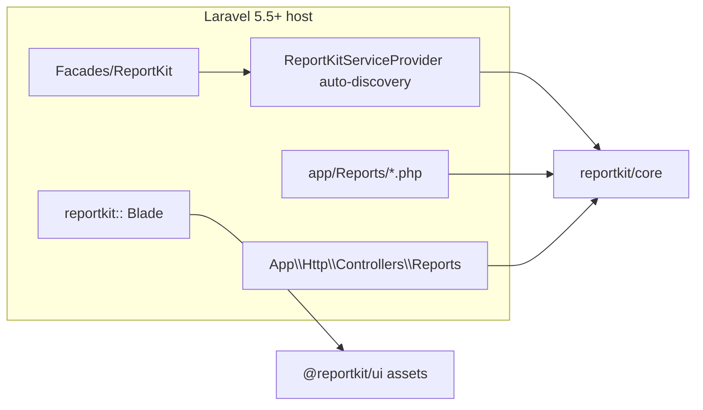

# reportkit/laravel

Laravel **5.5 → currently supported (12 / 13)** adapter for [ReportKit Core](https://github.com/Maijied/Reportkit-Core).

Auto-discovered provider + facade, CAS Blade views (`reportkit::`), and Artisan:

```bash
php artisan reportkit:install
php artisan reportkit:make Demo --route=admin/demo-report --preset=hybrid --layout=layouts.app --dry-run
```

> PHP ≥ 7.0 · Pair with [`@reportkit/ui`](https://github.com/Maijied/Reportkit-UI)  
> Repository: [Maijied/Reportkit-Laravel](https://github.com/Maijied/Reportkit-Laravel)

For Laravel **4.1–5.4** use [`reportkit/laravel-legacy`](https://github.com/Maijied/Reportkit-Laravel-Legacy).

## Author

**Mohammad Maizied Hasan Majumder** \<mdshuvo40@gmail.com\>  
Founder & Principal Engineer at Lorapok Labs · Senior Software Engineer @ Shohoz Ltd

## Architecture



## Features

- Auto-discovered provider and `ReportKit` facade (`extra.laravel` in `composer.json`)
- View namespace `reportkit::` with optional `php artisan vendor:publish --tag=reportkit-views`
- `reportkit:install` checklist
- `reportkit:make` full stack stubs (modern paths under `app/Http/Controllers/Reports`, `resources/views/reports`, `tests/Feature/Reports`)
- `--layout` option (default `layouts.app`)
- Opt-in `ReportKit::routes()` when `routes.enabled` is true (default **false**)
- Does **not** rewrite existing host reports

## Requirements

- PHP **≥ 7.0**
- `illuminate/support` `>=5.5 <14`
- `reportkit/core` `0.1.*|dev-main`
- Laravel **5.5 → current** (through **12 / 13**)

## Install

```bash
composer require reportkit/core reportkit/laravel
```

VCS until Packagist:

```json
{
  "repositories": [
    { "type": "vcs", "url": "https://github.com/Maijied/Reportkit-Core.git" },
    { "type": "vcs", "url": "https://github.com/Maijied/Reportkit-Laravel.git" }
  ],
  "require": {
    "reportkit/core": "dev-main",
    "reportkit/laravel": "dev-main"
  }
}
```

Provider / alias are **auto-discovered** on Laravel 5.5+. Manual registration is only needed on discovery-less hosts.

Copy UI assets from [Reportkit-UI](https://github.com/Maijied/Reportkit-UI):

```bash
mkdir -p public/css/reportkit public/js/reportkit
# copy css/reportkit.css
# copy css/reportkit-compat.css
# copy js/reportkit.js
```

```bash
php artisan reportkit:install
php artisan reportkit:make Demo --route=admin/demo-report --preset=hybrid --layout=layouts.app
composer dump-autoload
```

Create `app/Reports/` — the provider auto-requires `*.php` on boot. Register the printed routes (`{{route}}/data` for DataTables). Domain SQL stays in `app/Repositories/Reports`.

Full checklist: [docs/INSTALL.md](docs/INSTALL.md).

## Ecosystem

| Package | Role |
|---------|------|
| `reportkit/core` | Engine (PHP 5.6 → current) |
| `reportkit/laravel-legacy` | Laravel 4.1–5.4 — [Reportkit-Laravel-Legacy](https://github.com/Maijied/Reportkit-Laravel-Legacy) |
| `reportkit/laravel` | This repository (5.5 → current / 12 / 13) |
| `@reportkit/ui` | Browser CSS/JS — [Reportkit-UI](https://github.com/Maijied/Reportkit-UI) |

## License

MIT © Mohammad Maizied Hasan Majumder / Lorapok Labs
