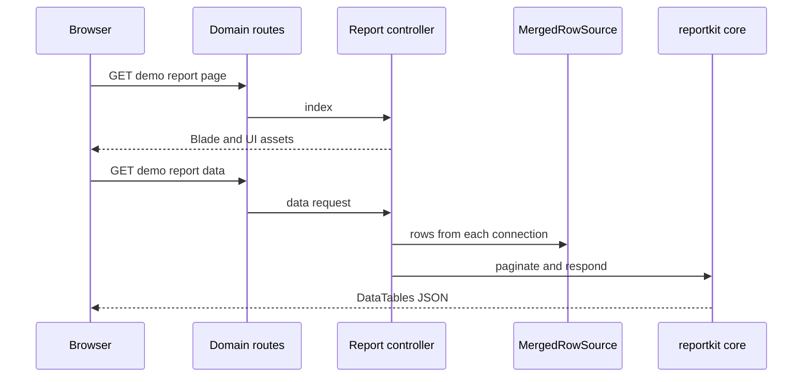
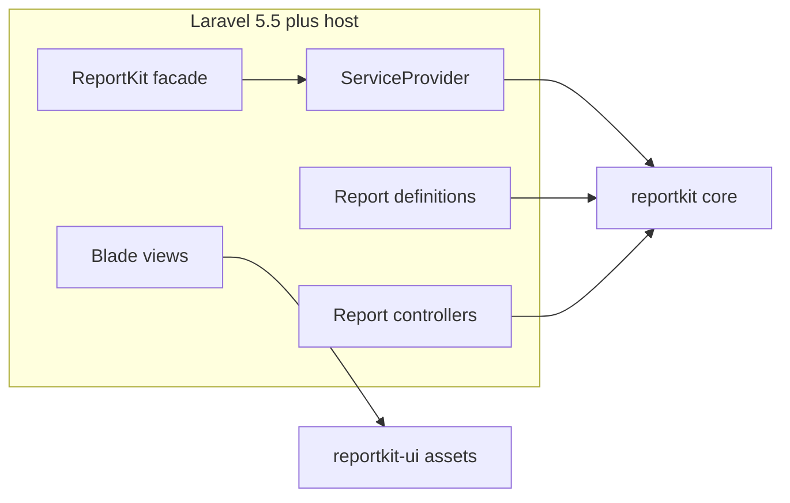

<p align="center">
  
</p>

<h1 align="center">ReportKit&nbsp;for&nbsp;Laravel</h1>

<p align="center"><strong>Multi-database reports for Laravel 5.5 → 13 — install, scaffold, ship.</strong></p>

<p align="center">
  
  <a href="https://packagist.org/packages/reportkit/laravel"></a>
  <a href="https://packagist.org/packages/reportkit/laravel"></a>
  
  
  <a href="https://github.com/Maijied/Reportkit-Core/actions/workflows/laravel-ci.yml"></a>
  <a href="LICENSE"></a>
</p>

<p align="center">
  <a href="https://reportkit.lorapok.tech"></a>
</p>

<p align="center">
  <a href="https://reportkit.lorapok.tech">Website &amp; Docs</a> ·
  <a href="https://reportkit.lorapok.tech/showcase">Live Demo</a> ·
  <a href="docs/INSTALL.md">Install guide</a> ·
  <a href="https://github.com/Maijied/Reportkit-Core/tree/main/reportkit-laravel-legacy">Laravel 4.1–5.4</a>
</p>

> **Part of the Lorapok Labs ecosystem.** The modern Laravel adapter for [ReportKit Core](https://github.com/Maijied/Reportkit-Core) — auto-discovered provider, `ReportKit` facade, CAS Blade views, and Artisan scaffolding.

---

## What you get

- **Auto-discovered** service provider + `ReportKit` facade (`extra.laravel`).
- `php artisan reportkit:install` — one-command setup, optional `--with-config --publish-assets`.
- `php artisan reportkit:make` — full-stack report stubs (controller, views, tests, JS).
- View namespace `reportkit::` (publishable) and opt-in `ReportKit::routes()`.
- Never rewrites your existing reports.

```bash
php artisan reportkit:install --with-config --publish-assets
php artisan reportkit:make Demo --route=admin/demo-report --preset=hybrid --layout=layouts.app
```

---

## How a report flows



## Architecture



---

## Requirements

- PHP **≥ 7.0**
- `illuminate/support` `>=5.5 <14`
- `reportkit/core` (beta channel allowed)
- Laravel **5.5 → current (12 / 13)**

## Install

```bash
composer require reportkit/core reportkit/laravel
```

Beta channel:

```bash
composer require "reportkit/laravel:^0.1@beta"
```

<details>
<summary>Install from Git (VCS) before/after Packagist</summary>

```json
{
  "repositories": [
    { "type": "vcs", "url": "https://github.com/Maijied/Reportkit-Core.git" }
  ],
  "require": {
    "reportkit/core": "dev-main",
    "reportkit/laravel": "dev-main"
  }
}
```

</details>

Provider and facade are **auto-discovered** on Laravel 5.5+. Then:

```bash
php artisan reportkit:install --with-config --publish-assets
php artisan reportkit:make Demo --route=admin/demo-report --preset=hybrid --layout=layouts.app
composer dump-autoload
```

Create `app/Reports/` — the provider auto-requires `*.php` on boot. Register the printed routes (`{{route}}/data` for DataTables). Domain SQL stays in `app/Repositories/Reports`. Full checklist: [docs/INSTALL.md](docs/INSTALL.md).

## Merge multiple databases

```php
use ReportKit\Core\Source\MergedRowSource;
use ReportKit\Laravel\Source\ConnectionRowSource;

$domain = function ($query, array $filters) {
    return $query->from('orders')
        ->whereBetween('created_at', [$filters['start_date'], $filters['end_date']]);
};

$live    = new ConnectionRowSource('mysql', $domain, null, 'live');
$archive = new ConnectionRowSource('mysql_archive', $domain, null, 'archive');

$source = (new MergedRowSource([$live, $archive]))
    ->dedupeBy('id')                 // first source wins (live over archive)
    ->orderBy('created_at', 'desc');

$rows = $source->getRows($filters);  // merged + deduped + sorted
// $source->getTrace() → per-source row counts + timings for demos/debugging
```

---

## Ecosystem

| Package | Role |
|---------|------|
| [`reportkit/core`](https://github.com/Maijied/Reportkit-Core) | Engine (PHP 5.6 → 8.5) |
| [`reportkit/laravel-legacy`](https://github.com/Maijied/Reportkit-Core/tree/main/reportkit-laravel-legacy) | Laravel 4.1 – 5.4 |
| [`reportkit/laravel`](https://github.com/Maijied/Reportkit-Core/tree/main/reportkit-laravel) | This package (5.5 → 12 / 13) |
| [`@lorapok-labs/reportkit-ui`](https://github.com/Maijied/Reportkit-Core/tree/main/reportkit-ui) | Browser CSS/JS |

## Author

**Mohammad Maizied Hasan Majumder** (Maijied) · Senior Software Engineer @ **Shohoz Ltd** · Founder and Principal Engineer @ **Lorapok Labs**  
Dhaka, Bangladesh · [mdshuvo40@gmail.com](mailto:mdshuvo40@gmail.com) · [GitHub @Maijied](https://github.com/Maijied)

Full profile: [AUTHORS.md](../AUTHORS.md)

## License

MIT © Mohammad Maizied Hasan Majumder / Lorapok Labs
